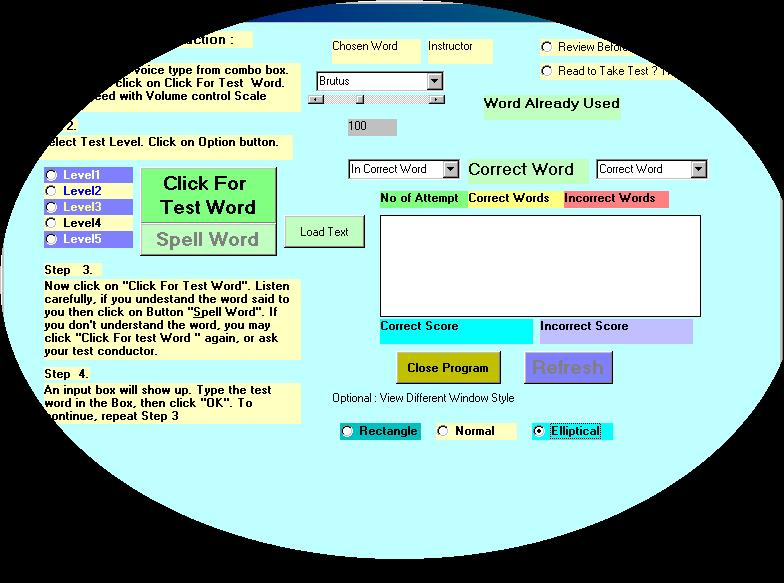



## Genie SpellTest

### Description

I downloaded sapi4sdksuite.exe from microsoft, and noticed many of you have contributed codes using TTS and voice command. I am just following the trail. You also need Msagent and Genie.exe for window 98. I developed this program in W 2k professional and tested in win 98. With option buttons, I tried to load a text pad with words, TTS will say the word to spell. I used combo box to display correct/incorrect word and track down if word is retyped during the test or we are trying to cheat the test typing one word over and again. Codes are very simple, I would take positive feed back. I targeted this application to 2/3rd graders. We can Edit the note pads (zipped) as you like and then take the test.

You will be able to reshape the form using handles.
 
### More Info
 

             |
---                |---
**Submitted On**   |2001-01-17 15:54:00
**By**             |[Manas Mukherjee](https://github.com/Planet-Source-Code/PSCIndex/blob/master/ByAuthor/manas-mukherjee.md)
**Level**          |Intermediate
**User Rating**    |5.0 (10 globes from 2 users)
**Compatibility**  |VB 6\.0
**Category**       |[Complete Applications](https://github.com/Planet-Source-Code/PSCIndex/blob/master/ByCategory/complete-applications__1-27.md)
**World**          |[Visual Basic](https://github.com/Planet-Source-Code/PSCIndex/blob/master/ByWorld/visual-basic.md)
**Archive File**   |[CODE\_UPLOAD138751182001\.zip](https://github.com/Planet-Source-Code/manas-mukherjee-genie-spelltest__1-14494/archive/master.zip)

